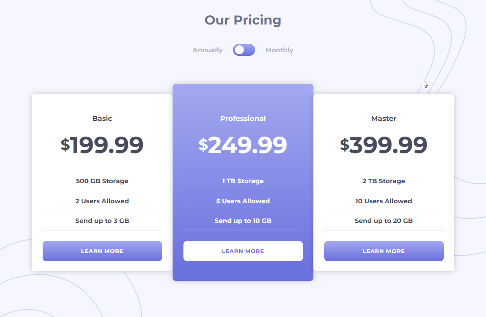
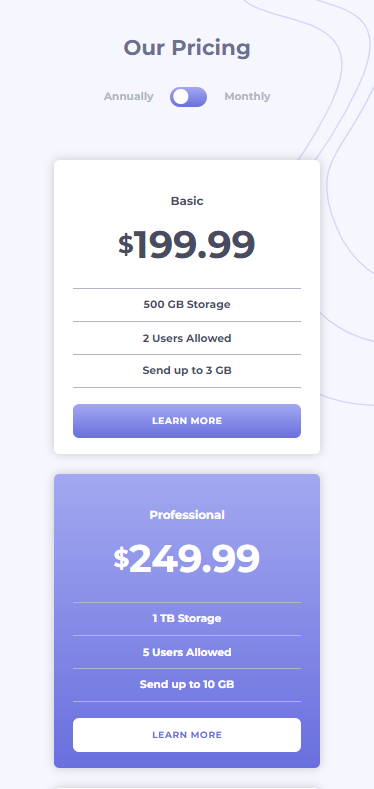

# pricing-component-toggle

A Component of pricing with a toggle between payments monthly or annually. 

My first project using SASS

[This is a challenge of FrontEnd Mentor](https://www.frontendmentor.io/challenges/pricing-component-with-toggle-8vPwRMIC).

## Result

> ### See the result live [here](https://pricing-component-toggle-lusk1nha.vercel.app/)

Desktop Version -

Mobile Version -

